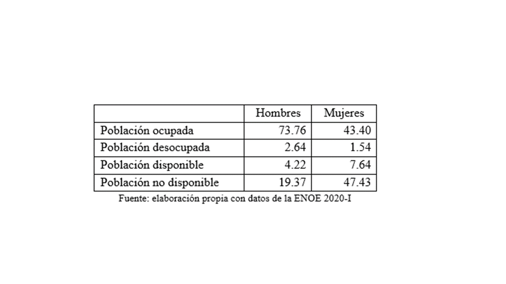

---
output:
  pdf_document: default
geometry: margin=1in
fontsize: 11pt
bibliography: Fuentes.bib
csl: "mi_chicago.csl"
header-includes :
  \usepackage{geometry}
  \usepackage{graphicx}
  \usepackage{floatrow}
   \floatsetup[figure]{capposition=top}
  \floatsetup[table]{capposition=top}
  \floatplacement{figure}{H}
  \floatplacement{table}{H}
  \tolerance=1
  \emergencystretch=\maxdimen
  \hyphenpenalty=10000
  \hbadness=10000
  \linespread{1.3}
  \usepackage[justification=centering, font=bf, labelsep=period, skip=5pt]{caption} 
  \usepackage{titling}
  \usepackage[spanish]{babel}
  \usepackage{fancyhdr}
  \pagestyle{fancy}
  \fancyhead[L]{Macroeconomía Aplicada}
  \fancyhead[R]{ITAM}
---
\begin{titlepage}
\begin{center}

\textsc{\Large Instituto Tecnológico Autónomo de México}\\[2em]

\textbf{\LARGE Macroeconomía Aplicada}\\[2em]


\textsc{\LARGE }\\[1em]


\textsc{\large Participación de las mujeres en el mercado laboral mexicano }\\[1em]

\textsc{\LARGE }\\[1em]

\textsc{\large }\\[1em]
\textsc{\LARGE }\\[1em]

\textsc{\LARGE Profesor Víıctor Góomez Ayala}\\[1em]

\textsc{\LARGE }\\[1em]

\textsc{\LARGE Maite García de Alba Rivas}\\[1em]

\textsc{\large 107852}\\[1em]

\textsc{\LARGE Marco Antonio Ramos Juárez}\\[1em]

\textsc{\large 142244}\\[1em]

\end{center}

\vspace*{\fill}
\textsc{Ciudad de México \hspace*{\fill} 2020}

\end{titlepage}


\newpage


\tableofcontents

\newpage
# Introducción 

El género suele ser un indicador de estratificación y exclusión [@PNUD2013] que deriva en diferencias sistemáticas en términos de bienestar material entre mujeres y hombres. Dichas diferencias se deben, en gran medida, a un menor acceso por parte de las mujeres a insumos productivos tales como el trabajo remunerado, crédito y activos.

En lo que se refiere al trabajo remunerado, las preferencias personales, la cultura, la tradición y la discriminación tienen efectos en la participación económica de las mujeres y en los salarios que perciben y, por lo tanto, en el poder de negociación que ostentan al interior del hogar. Derivado de lo anterior, las mujeres participan en menor medida en el mercado laboral y, una vez dentro, tienen menos probabilidad de ser contratadas[@ILO2017]. Asimismo, las mujeres suelen percibir menores salarios y dedicar un menor número de horas al trabajo remunerado. Sin embargo, si se considera el trabajo remunerado y no remunerado, las mujeres trabajan más horas al día, lo que tiene efectos en el ocio y en el bienestar que experimentan. 

En ese sentido, resulta fundamental considerar al sector económico y al sector doméstico de manera conjunta, a fin comprender los factores que inciden en la participación laboral y en el bienestar de mujeres y hombres. Si bien existen muchas políticas orientadas a igualar las condiciones de las mujeres y de los hombres, muchas de ellas carecen de un análisis más comprehensivo, que considere simultáneamente los efectos directos e indirectos, así como las implicaciones tanto en el sector económico como en el sector doméstico. Asimismo, muchas veces se llevan a cabo análisis de equilibrio general, pero que parten de suponer efectos neutrales al sexo de determinadas medidas como políticas de mayor apertura comercial, mejoras tecnológicas en la producción de bienes de determinados sectores, o choques en la demanda de bienes.

Con base en un modelo dinámico estocástico de equilibrio general (DSGE), la presente investigación busca ofrecer respuestas a la siguiente pregunta: ¿cuál es el efecto diferenciado por género de choques en la demanda de bienes domésticos en el tiempo dedicado al ocio? De manera concreta, incrementos en la fertilidad, por ejemplo, conllevan incrementos en la demanda de bienes domésticos, que en de manera agregada se observan en el número de horas dedicadas al sector doméstico con fines de cuidado, limpieza y alimentación, entre otros. Así pues, se esperan efectos heterogéneos en términos de participación económica, trabajo doméstico y ocio para mujeres y hombres.

Para ello, se llevan a cabo dos simulaciones de choques a la demanda de bienes domésticos, uno que considera un parámetro discriminatorio contra las mujeres, y otro que no lo considera. Únicamente la simulación con el parámetro discriminatorio arroja resultados consistentes con la realidad, en lo que se refiere al menor tiempo dedicado al ocio por parte de las mujeres. 

Dicha pregunta resulta especialmente relevante en el contexto mexicano en donde se observan importantes brechas de género. En México, de conformidad con cifras del @CONEVAL2018, por cada 100 hombres en situación de pobreza hay 109 mujeres en dicha condición. Más aún, por cada 100 hombres en pobreza extrema hay 133 mujeres en la misma situación. En términos de vulnerabilidad por ingresos también se observa que por cada 100 hombres vulnerables hay 120 mujeres vulnerables. 

Como se mencionaba anteriormente, las mujeres suelen experimentar un menor bienestar material, en parte atribuible a la falta de acceso a insumos productivos como el trabajo remunerado. Para el primer trimestre de 2020, más de la mitad de las mujeres no participaba de manera activa en el mercado laboral y el porcentaje de mujeres ocupadas es considerablemente más bajo, alrededor de 30 puntos porcentuales por debajo del observado en el caso de los hombres (ver tabla 1). Si bien en la última década la brecha de participación económica ha caído ocho puntos porcentuales, esto ha sido insuficiente para disminuir brechas en el bienestar material. 





Más aún, si se considera la composición de la población clasificada como no disponible, se observan diferencias radicales entre ambos sexos (ver tabla 2). De manera particular, se observa que la mayor parte de las mujeres (70.85%) no participa en el mercado laboral remunerado por dedicarse a los quehaceres domésticos. En contraste, la mayoría de los hombres que no se encuentran disponibles son estudiantes (40.04%) o son jubilados (25.62%). 


Por otro lado, si se analiza a la población ocupada y los salarios mensuales que perciben hombres y mujeres, es posible observar que la distribución de las mujeres se acumula en los ingresos inferiores y que más de un cuarto de ellas percibe hasta un salario mínimo. Los hombres, por su parte, tienen una distribución más hacia la derecha, lo que indica que en general perciben salarios superiores y solo 8.22% gana hasta un salario mínimo (ver gráfica 1). 


En los últimos 10 años, las brechas salariales no se han reducido, sino que han permanecido relativamente constantes en el tiempo (ver gráfica 2). Actualmente, el percentil 25 de los hombres es 53% mayor al de las mujeres. El salario medio de los hombres, por su parte, es casi 29% mayor. Gran parte de esa diferencia puede explicarse por el número de horas que cada grupo dedica a actividades en el sector económico. Las mujeres, en general, dedican menos tiempo al trabajo remunerado. Sin embargo, un análisis de salario por hora también revela una importante brecha. Lo anterior, implica que el costo de oportunidad de dedicar tiempo a las labores domésticas es menor para las mujeres. 


Con base en datos de la Encuesta Nacional sobre Uso del Tiempo es posible observar las diferencias en la asignación del tiempo entre mujeres y hombres. Por cada 100 horas que los hombres dedican al trabajo remunerado, las mujeres dedican 67; por cada 100 horas que los hombres dedican a labores domésticas, las mujeres dedican 257; y por cada 100 horas que los hombres dedican al ocio, las mujeres dedican 48. 

Por otro lado, la brecha salarial se relaciona con el estado conyugal. La razón de ingreso corriente de mujeres y hombres solteros es de 101.7, mientras que dicha razón es de 84.7 entre personas casadas o unidas. Es decir, cuando se compara a personas casadas con la misma ocupación, por cada 100 pesos que los hombres perciben, las mujeres perciben 84[@ENIGH].

Todo lo anterior da cuenta de la necesidad de llevar a cabo un análisis integral en el contexto mexicano que permita recoger el comportamiento diferenciado de hombres y mujeres, que incorpore el trabajo en el sector doméstico y que evalúe los efectos de choques en la demanda de bienes domésticos en las decisiones de asignación del tiempo y en el bienestar de cada uno. 

Como se verá en el apartado de revisión de literatura, poco se ha explorado al respecto mediante modelos DSGE que consideren conjuntamente el sector económico, el sector doméstico y el ocio y que dé cuenta de la heterogeneidad de los actores y que, simultáneamente expliquen la brecha salarial, la brecha de participación económica y la brecha en horas de ocio.

# Revisión de literatura

Tradicionalmente, el análisis económico partía de una división dicotómica del tiempo (trabajo-ocio) que dejaba fuera una importante porción de horas del día y que generaba sesgos en la estimación de demandas de bienes y de servicios. Becker[@Becker1965] fue el primero en proponer un nuevo enfoque que incorpora el sector de las actividades domésticas y modela a los hogares como “pequeñas fábricas” que combinan capital, materias primas y trabajo para producir ciertos bienes y servicios al interior del hogar (tales como limpieza, alimentación y procreación, entre otros). 

Dada la preponderante participación de las mujeres en el sector doméstico y la interacción entre los sectores económicos y no económicos, la inclusión del sector doméstico en los análisis conllevó el desarrollo de investigación de género en el mercado laboral, a fin de generar un mayor entendimiento sobre la participación de las mujeres en el mercado laboral.

La investigación de @Cowan1983 fue una de las primeras que concibió el trabajo doméstico como parte del sistema económico y social más amplio. Encontró que los cambios tecnológicos en la producción doméstica, derivados del periodo de industrialización, conllevaron caídas en el número de horas que los hombres dedicaban al hogar, pero no fue así para las mujeres. Si bien se trató de un análisis de corte cualitativo, da cuenta de los efectos heterogéneos que tiene un cambio tecnológico entre mujeres y hombres. 

@Greenwood2005, en contraste, y usando un modelo de equilibrio general dinámico encuentran que, dada la adopción de nuevas tecnologías del hogar, las mujeres reducen el tiempo dedicado al hogar e incrementan su participación económica. Una mejora tecnológica explica 28 de los 51 puntos porcentuales de incremento en la participación económica de las mujeres en EEUU a lo largo de un siglo. De conformidad con los autores, la mejora tecnológica, vuelve más elástica la oferta laboral de las mujeres. 

@Jones2015 se basan en @Becker1965 y @Benhabib1991 y parten de un modelo que considera los sectores doméstico y económico, así como la producción y el consumo de bienes y servicios en el hogar y en el mercado. A partir de ello, con un modelo dinámico de equilibrio general, analizan (i) los efectos de una reducción en la brecha salarial, y (ii) los efectos de una mejora tecnológica en la producción de bienes del hogar, en la participación económica de las mujeres casadas y solteras. 

Encuentran que los efectos de un cambio tecnológico suelen ser menores en términos de participación económica de las mujeres y que incluso pueden conllevar incrementos en las horas dedicadas al trabajo doméstico, para sustituir el consumo de bienes de mercado por bienes producidos en el hogar, que redujeron su precio. En contraparte, la reducción en la brecha salarial por sexo tiene efectos importantes para explicar el incremento en la participación de las mujeres casadas en el mercado laboral. De manera interesante, los autores atribuyen las diferencias salariales entre mujeres y hombres a la discriminación, por lo que cuando reducen exógenamente el parámetro discriminatorio, se explican los aumentos observados en la participación de las mujeres casadas y solteras en la fuerza laboral en Estados Unidos, en el periodo de la posguerra. De conformidad con los autores, el comportamiento diferenciado entre mujeres casadas y mujeres solteras ante cambios en la brecha salarial se debe, en gran medida, a las diferencias en la elasticidad de la oferta laboral. 

En el mismo sentido, @Marino2016 analizan los efectos de políticas fiscales en la participación laboral de las mujeres casadas y solteras, de manera diferenciada, partiendo de reconocer las distintas elasticidades de sustitución del trabajo doméstico y del trabajo remunerado, entre ambos tipos de mujeres. 
Por su parte, @Doepke2016 también consideran que la economía familiar y la macroeconomía están íntimamente relacionadas. Encuentran que cambios en la estructura familiar repercuten en la oferta agregada de trabajo.
Otra corriente de investigación analiza la demanda de trabajo de mujeres para explicar los niveles de participación económica de ambos sexos. En esa línea, @Stempel2019 parten de un DSGE con dos sectores, el económico y el doméstico, y analizan los efectos macroeconómicos de diferentes shocks en entornos laborales en los que existe discriminación contra las mujeres por parte de los empleadores. 

Encuentran que en el estado estacionario la discriminación conlleva a una asignación ineficiente de tiempo por parte de las mujeres y de los hombres. Las mujeres dedican más tiempo a las labores domésticas y menos tiempo al trabajo remunerado del que se considera como óptimo. Esto, a su vez, conlleva a una menor productividad, a brechas salariales y a un menor bienestar agregado. En un contexto de esa naturaleza, shocks tecnológicos positivos agudizan las condiciones mencionadas en el estado estacionario, incrementan la brecha salarial y conllevan incrementos ineficientes en la productividad y en la oferta laboral. Por otro lado, shocks de política monetaria también se muestran débiles en sus efectos en un entorno discriminatorio. 

La incorporación de un parámetro discriminatorio contra las mujeres y su capacidad para evitar sesgos en las estimaciones va de la mano con lo planteado por @Elson1999, en el sentido de que los mercados laborales no son entidades neutrales, sino que son instituciones con sesgos por sexo, que operan en la intersección entre las economías productiva y reproductiva. 

En el mismo sentido, @Khera2016 considera las fricciones que existen en el mercado laboral e incorpora un parámetro discriminatorio y diferentes poderes de negociación entre mujeres y hombres a fin de analizar el éxito de políticas orientadas a fomentar la participación económica de las mujeres (como la provisión pública de guarderías, mejoras en la movilidad y seguridad de las mujeres y mejoras educativas de las mujeres) en el mercado laboral formal e informal. Encuentra que, si bien las políticas analizadas incrementan la participación de las mujeres, lo hacen de manera débil, debido a la discriminación de género que vuelve más rígida la demanda laboral. 

Como se observa, existe una amplia literatura que vincula el sector doméstico y el sector económico para explicar cambios en la participación económica de las mujeres, tanto desde una perspectiva de oferta como de demanda de trabajo femenino. Sin embargo, dichos estudios pasan por alto los efectos heterogéneos que esto tiene en términos de ocio y, por lo tanto, de bienestar. Ese vacío de investigación se encuentra cubierto, principalmente, por modelos CGE que, si bien aportan una perspectiva interesante, carecen de un componente estocástico y dinámico. 

Tal es el caso de la investigación de @Fontana2000 que implementan un CGE para un análisis integral de los efectos diferenciados, directos e indirectos, que tienen cambios en las políticas de comercio exterior en las mujeres y los hombres. Para ello, desagregan los factores de producción en hombres y mujeres y permiten la interacción de tres sectores económicos (agricultura, manufacturas y servicios) y dos no económicos (trabajo doméstico y ocio). 

En ese contexto, analizan el impacto de cambios en las políticas de comercio exterior en el uso que mujeres y hombres dan a su tiempo: actividades de mercado, trabajo doméstico y ocio. Encuentran que no todas las políticas que incrementan la participación económica de las mujeres conllevan mejoras en su bienestar, una vez que se consideran los efectos en el tiempo que dedican al ocio. Lo anterior es sumamente relevante pues lleva a reconsiderar ciertas políticas, al menos de manera aislada. 

@Fofana2003 elaboran sobre el modelo de @Fontana2000, incrementan el número de sectores y analizan los impactos no sólo de género, sino por tipo de hogar. Su objetivo es determinar cuáles son los efectos de la liberalización del comercio exterior en Nepal en el trabajo remunerado y no remunerado de las mujeres, en la desigualdad de ingresos, en el tiempo que dedican al ocio y en los bienes que consumen los hogares. Encuentran efectos diferenciados entre hombres y mujeres, y entre hogares urbanos y rurales. En general, las políticas que incrementan el trabajo de las mujeres en sectores económicos reducen el tiempo de ocio de las mujeres, mientras que el trabajo doméstico permanece constante. 

Finalmente, @Ferrero2003 analiza la relación entre participación económica de la mujer y la fertilidad y encuentra que, tras cambios tecnológicos que han favorecido a los individuos de mayor habilidad, se ha incrementado el costo de oportunidad de las mujeres con altos niveles de habilidad de permanecer en casa. No obstante, dado el sesgo del cambio tecnológico, también se ha reducido el costo de cuidados por parte de mujeres de bajas habilidades, por lo que simultáneamente se han incrementado los niveles de participación económica de las mujeres y su fertilidad.

Como se ha observado a lo largo de esta revisión de literatura, poco se ha abordado desde modelos DSGE sobre los efectos de diferentes tipos de shocks en el tiempo asignado al ocio por parte de mujeres y hombres. La mayoría de las investigaciones se aboca a investigar los efectos de diversos shocks y la sustituibilidad entre el trabajo y los bienes de mercado y el trabajo y los bienes domésticos. Asimismo, en general, se observa que hay poca investigación a nivel macroeconómico sobre los efectos de shocks exógenos a la demanda de bienes domésticos en términos de asignación del tiempo, como la fertilidad. Mucha investigación considera la fertilidad endógenamente. 
Por ello, la presente investigación retoma diversos elementos de la literatura revisada a fin de evaluar los efectos diferenciados de shocks a la demanda de bienes domésticos en el uso del tiempo de mujeres y hombres. De manera específica, se analizan los efectos en términos de ocio, que suelen ser pasados por alto y que pueden llevar a que diferentes shocks que mejoren la participación económica de las mujeres terminen por empeorar su bienestar, en términos generales, a pesar de incrementos en el consumo de bienes, derivado de un menor consumo de ocio[@Haworth2005].


# Modelo

El modelo propuesto en esta investigación forma parte de 3 familias de modelos: A) los modelos con producción en el hogar; B) aquellos que contemplan manos de obra diferenciadas; y, en menor medida, C) aquellos que contemplan la existencia de efectos de discriminación por género en las preferencias de los hogares y de las empresas.


## Problema de los hogares

Nuestro modelo es muy similar al modelo canónico de crecimiento neoclásico con algunos cambios. Parte de la especificación de un hogar compuesto por una pareja de individuos quienes consumen bienes de mercado y bienes domésticos y  reparten su tiempo entre trabajo remunerado, trabajo doméstico (no remunerado) y ocio. Mientras que el ocio de cada individuo brinda utilidad al hogar de manera independiente, el consumo de los bienes es el mismo para el hogar en su conjunto. Finalmente, en las preferencias especificamos el termino $\kappa$ que denota el factor de discriminación a nivel de las preferencias del hogar.^[Notemos que si $\kappa$ vale .5 no existe efecto discrimnatorio]

\begin{equation}
\sum_{t=0}^\infty \beta^t[U(C_t,L_m^m,L^m_h,L_m^h,L_h^h)]
\end{equation}

\begin{equation}
U(C_t,L_t)= \gamma log(C_t)+\lambda(1-\gamma)log(H-L_m^m-L_h^m)+(1-\lambda)(1-\gamma)log(H-L_m^h-L_h^h)
\end{equation}

\begin{equation}
C_t=[\omega C_m^\eta+(1-\omega)C_h^\eta]^\frac{1}{\eta}
\end{equation}

\begin{equation}
C_m+S=W_mL^m_m+WhL_m^h+RK
\end{equation}

\begin{equation}
K_{t+1}=(1-\delta)K_t+I_t
\end{equation}


## Problema de las empresas

En cuanto a las empresas, el problema es identico al del modelo canónico con la excepción que la fuerza laboral se encuentra desagregada por género. En el modelo, $L$ ahora es una función de fuerza laboral CES en la que se permite que el trabajo de los hombres y las mujeres pueda ser desde sustituos hasta complementos y que tengan distintos rendimientos marginales. Esto implica la posibilidad de salarios diferenciados.

  \begin{equation}
Y=AK^\alpha [\nu (L_m^m)^\xi + (1-\nu) (L_m^h)^\xi]^\frac{(1-\alpha)}{\xi}
\end{equation}

\begin{equation}
log A_t=(1-\rho_A)\overline{A}+\rho_AA_{t-1}+\epsilon_t^A
\end{equation}

\begin{equation}
max_{KL}=AK^\alpha [\nu (L_m^m)^\xi + (1-\nu) (L_m^h)^\xi]^\frac{(1-\alpha)}{\xi}-RK-W_mL^m_m-W_hL_m^h
\end{equation}

## Problema de producción del hogar

Finalmente, especificamos una función de producción de producción doméstica donde nuevamente $L$ es una función de trabajo CES compuesta y distinta a la de las empresas.

\begin{equation}
C_h=B[\tau (L_h^m)^\psi + (1-\tau) (L_h^h)^\psi]^\frac{\theta}{\psi}
\end{equation}

\begin{equation}
log B_t=(1-\rho_B)\overline{B}+\rho_BB_{t-1}+\epsilon_t^B
\end{equation}

## Equilibrio

En este modelo los hogares deben decidir que proporción de sus tiempos disponibles deben dedicar a cada actividad. El equilibrio competitivo de la economía se define como el conjunto de las 14 ecuaciones siguientes que representa a la secuencia de variables edndógenas $\{Y_t,C_{mt},C_{ht},I_t,K_t,L_{mt}^m,L_{ht}^m,L_{mt}^h,L_{ht}^h,R_t,W^m_t,W^h_t\}$ y las dos tecnologías $A_t$ y $B_t$ que se asumen como endógneas y que siguen un proceso autoregresivo de orden 1.

## Condiciones de eficiencia 

Estas primeras 4 condiciones de eficiencia se derivan de las CPOs y determinan la distribución del tiempo para cada individuo del hogar de manera estática. En ellas, los costos de trabajar en las empresas y en los hogares se igualan a los beneficios.

\begin{equation}
\frac{\gamma\omega C_m^{\eta-1}}{\omega C_m^\eta+(1-\omega)C_h^\eta}=\frac{\lambda(1-\gamma)}{W_m(H-L_m^m-L_h^m)}
\end{equation}


\begin{equation}
\frac{\gamma\omega C_m^{\eta-1}}{\omega C_m^\eta+(1-\omega)C_h^\eta}=\frac{(1-\lambda)(1-\gamma)}{W_h(H-L_m^h-L_h^h)}
\end{equation}


\begin{equation}
\frac{\gamma(1-\omega)C_h^{\eta-1}}{\omega C_m^\eta+(1-\omega)C_h^\eta}[\theta B[\tau (L_h^m)^\psi + (1-\tau) (L_h^h)^\psi]^\frac{\theta-\psi}{\psi}][\tau (L_h^m)^{\psi-1}]=\frac{\kappa(1-\gamma)}{(H-L_m^m-L_h^m)}
\end{equation}


\begin{equation}\frac{\gamma(1-\omega)C_h^{\eta-1}}{\omega C_m^\eta+(1-\omega)C_h^\eta}[\theta B[\tau (L_h^m)^\psi + (1-\tau) (L_h^h)^\psi]^\frac{\theta-\psi}{\psi}][(1-\tau) (L_h^m)^{\psi-1}]=\frac{(1-\gamma) (1-\kappa)}{(H-L_m^h-L_h^h)}
\end{equation}

Finalmente, la ecuación 15 la podemos interpretar como una versión de la ecuación de Euler para una economía que contempla producción doméstica. En dicha ecuación dinámica se determina la ruta de consumo óptima estableciendo la relación entre los consumos de mercado intertemporables con la tasa de interés real. 

\begin{equation}
\frac{\frac{ C_{m.t}^{\eta-1}}{\omega C_{m,t}^\eta+(1-\omega)C_{h,t}^\eta}}{\frac{ C_{m.t+1}^{\eta-1}}{\omega C_{m,t+1}^\eta+(1-\omega)C_{h,t+1}^\eta}}=\beta(1+R_{t+1)}-\delta)
\end{equation}

Las siguientes 4 condiciones de eficiencia se refieren a las ecuaciones del vaciado y son casi identicas a aquellas del modelo de crecimiento canónico. Solamente se cambian los $L$ por las funciones CES de trabajo compuesto y agregamos la función de producción doméstica.


\begin{equation}
Y_t=A_tK_{t-1}^\alpha [\nu (L_m^m)^\xi + (1-\nu) (L_m^h)^\xi]^\frac{(1-\alpha)}{\xi}
\end{equation}


\begin{equation}
C_h=B[\tau (L_h^m)^\psi + (1-\tau) (L_h^h)^\psi]^\frac{\theta}{\psi}
\end{equation}


\begin{equation}
K_t=T_t-C_{m,t}+K_{t-1}(1-\delta)
\end{equation}


\begin{equation}
I_t=Y_t-C_{m,t}
\end{equation}

Posteriormente, tenemos el bloque de ecuaciones de eficiencia relacionadas con los precios en donde obtenemos el salario para hombres, el salario para mujeres y la tasa de interés.

\begin{equation}
W_{m,t}=(1-\alpha)A_tK_{t-1}^\alpha[\nu (L_m^m)^\xi + (1-\nu) (L_m^h)^\xi]^\frac{1-\alpha-\xi}{\xi}[\nu (L_m^m)^{\xi-1}]
\end{equation}


\begin{equation}
W_{h,t}=(1-\alpha)A_tK_{t-1}^\alpha[\nu (L_m^m)^\xi + (1-\nu) (L_m^h)^\xi]^\frac{1-\alpha-\xi}{\xi}[(1-\nu) (L_m^h)^{\xi-1}]
\end{equation}


\begin{equation}
R_{t}=\alpha A_tK_{t-1}^{\alpha-1}[\nu (L_m^m)^\xi + (1-\nu) (L_m^h)^\xi]^\frac{1-\alpha}{\xi}
\end{equation}

Finalmente, agregamos nuestras ecuaciones sobre los procesos autoregresivos que puede tener los parámetros tecnológicos $A$ y $B$.

\begin{equation}
log A_t=(1-\rho_A)\overline{A}+\rho_AA_{t-1}+\epsilon_t^A
\end{equation}


\begin{equation}
log B_t=(1-\rho_B)\overline{B}+\rho_BB_{t-1}+\epsilon_t^B
\end{equation}

# Valores para México y simulaciones

## Valores de los parámetros para México

```{r echo=F, results='asis'}
library(kableExtra)
tb1 = data.frame(c("$\\alpha$","$\\beta$","$\\gamma$","$\\delta$","$\\eta$","$\\omega$","$\\theta$","$\\rho_A$","$\\rho_B$","$\\tau$","$\\psi$","$\\nu$","$\\xi$","H","$\\lambda$"),
           c("Parámetro de tecnología-capital","Factor de descuento","Preferencia de consumo-ocio","Tasa de depreciación","Sustitución entre bienes","Proporción de consumo de bienes","Productividad de la producción doméstica","Parámetro autoregresivo de la PTF","Parámetro autoregresivo de la productividad del hogar","Proporción de participación de las mujeres en labores domésticas","Sustitución mujer/hombre en el hogar", "Participación de las mujeres en las empresas","Sustitución mujer/hombre en la empresa","Tiempo disponible", "Discriminación de la mujer en las preferencias hogar"),c(0.350,0.980,0.400,0.050,0.800,0.450,0.800,0.950,0.950,0.550,0.700,0.450,0.700,24.000,0.500))

knitr::kable(tb1, escape = FALSE, col.names = c("Parámetro", "Definición","Valor"), "latex", booktabs = T)%>%
  kable_styling(position = "center")

```

En cuanto a los valores de los parámetros $\alpha$, $\beta$, $\gamma$ y $\delta$ los tomamos de la literatura y son valores ya calibrados para el país[@garcia]. En cuanto a $\eta$, $\omega$, $\theta$, que se refieren a los parámetros relacionados con los modelos de producción doméstica, dificilmente existe literatura con valores calibrados para los países, por lo que tomamos los valores que recopila Torres Chacón en *Introduction to Dynamic Macroeconomic General Equilirbium Models*.

En cuanto a $\psi$ y $\xi$ (los parámetros de sustitución de trabajo remunerado y doméstico), fueron valores supuestos con base en los hallazgos en investigaciones aplicadas como la de Ishizuka[@salarios] que menciona que este tipo de parámetros tienen valores de entre .6 y 1, dependiendo del sector.

Finalmente, los valores de $\nu$ y $\tau$ que indirectamente determinan la productividad de cada género en cada sector fueron supuestos con base en las investigaciones de Fontana.


## Estados estacionarios

En esta sección mostramos dos estados estacionarios que provienen de la misma especificación con excpeción de una cosa: el uso del paramétro de discrimación $\lambda$. Mientras que en el estado estacionario A $\lambda=.5$, lo que implica que no se está usando pues el tiempo de hombres y mujeres está ponderado igual; en el estado estacionario B proponeos una $\lambda=.4$, lo que implica un efecto de discriminación. Como se verá a continuación, el estado estacionario B se acerca más a las cifras de horas de ocio-trabajo analizadas proporcionadas por la INEGI.

### Estado estacionario A

La siguiente tabla muestra los valores del estado estacionario A.

```{r echo=F, results='asis'}


tb2 = data.frame(c("$Y$","$C_m$","$C_h$","$I$","$K$","$L^m_m$","$L^m_h$","$L^h_m$","$L^h_h$","$W_m$","$W_h$","$R$","$O_m$","$O_h$"),
           c("Producción","Consumo de bienes de mercado","Consumo de bienes del hogar","Inversión","Capital","Horas de trabajo remunerado de las mujeres","Horas de trabajo doméstico de las mujeres","Horas de trabajo remunerado de los hombres","Horas de trabajo doméstico de los hombres","Salario de las mujeres","Salario de los hombres", "Tasa de interés","Horas libres de las mujeres despúes de descanso","Horas libres de los hombres después de descanso"), c(0.477,0.358,0.233,0.118,2.374,3.336,5.136,6.192,2.496,0.776,0.787,0.070,5.528,5.312), c(1.000,0.751,0.487,0.248,4.971,"-","-","-","-","-","-","-","-","-"))

knitr::kable(tb2, escape = FALSE, col.names = c("Variable", "Definición","Valor","Normalización"), "latex", booktabs = T)%>%
  kable_styling(position = "center")
```


### Estado estacionario B


```{r echo=F, results='asis'}

tb3 = data.frame(c("$Y$","$C_m$","$C_h$","$I$","$K$","$L^m_m$","$L^m_h$","$L^h_m$","$L^h_h$","$W_m$","$W_h$","$R$","$O_m$","$O_h$"),
           c("Producción","Consumo de bienes de mercado","Consumo de bienes del hogar","Inversión","Capital","Horas de trabajo remunerado de las mujeres","Horas de trabajo doméstico de las mujeres","Horas de trabajo remunerado de los hombres","Horas de trabajo doméstico de los hombres","Salario de las mujeres","Salario de los hombres", "Tasa de interés","Horas libres de las mujeres despúes de descanso","Horas libres de los hombres después de descanso"),c(0.448,0.336,0.250,0.111,2.227,4.152,6.453,4.843,1.968,0.711,0.831,0.070,3.368,7.184),c(1.000,0.751,0.487,0.248,4.971,"-","-","-","-","-","-","-","-","-"))

knitr::kable(tb3, escape = FALSE, col.names = c("Variable", "Definición","Valor","Normalización"), "latex", booktabs = T)%>%
  kable_styling(position = "center")

```

Lo primero que podemos notar esque la producción es menor en la medida en que comencemos a usar el parámetro de discriminación $\lambda$. En segundo  lugar, notamos que las proporciones de las variables con respecto a $Y$ son identicas. En tercer lugar, podemos observar como en este segundo estado estacionario, existen las 3 brechas observadas en la realidad: aquella de salarios, aquella de participación laboral y aquella del ocio.


## Simulación

Con el fin de simular la urgencia momentanea de aumentar la demanda de bienes domésticos proponemos una tercera ecuación autoregresiva de orden 1. Por ejemplo, pensemos en el nacimiento de un nuevo integrante de la familia lo que implica que el trabajo doméstico aumente momentaneamente.

$$log E_t=(1-\rho_E)\overline{E}+\rho_EE_{t-1}+\epsilon_t^E$$

El parametro E (con varianza 0 y media 1) ahora multiplica a la proporción que se demanda de bienes domésticos en la ecuación de consumo compuesto inicial:

$$C_t=[\omega C_m^\eta+E(1-\omega)C_h^\eta]^\frac{1}{\eta}$$


\newpage

### Función impulso respuesta en A

A continuación simulamos el aumento de la demanda de bienes domésticos en la economía sin discriminación.


{width=70%}

{width=70%}

### Función impulso respuesta en B

A continuación simulamos el aumento de la demanda de bienes domésticos en la economía con discriminación.

{width=70%}

{width=70%}

Lo que podemos observar es que en primer lugar, el solo hecho de contemplar el uso de un parámetro de discriminación ocasiona que el estado estacionario de la producción sea menor. En segundo lugar, notamos que en ambas simulaciones, ante el choque en la demanda de bienes domésticos, la producción y el consumo de mercado cae drásticamente.

En cuanto a las variables de género (cateogrizadas en la gráfica con una a para mujeres y una b para hombres) notamos como el choque en la demanda de bienes domésticos modifica los incentivos para que tanto las mujeres y los hombres se queden en casa pero con un efecto más marcado en las mujeres (situación que es más evident en la segunda simulación). Asimismo, esta situación hace que la mano de obra sea escasa y aumenten los salarios para ambos géneros, sin embargo, los hombres son los principales beneficiados pues se integran con mayor rapidez al trabajo remunerado.

Finalmente, en cuanto al ocio, notamos que hay un efecto inicial positivo en ambos géneros para ambas simulaciones, sin embargo, el choque de la demanda de bienes domésticos rapidamente hace que las mujeres comienzen a trabajar más que los hombres a costa de su ocio. La recuperación del ocio se da de manera lenta (y más lenta si activamos el parametro de discriminación) a la par que  el aumento en ocio de los hombres se mantiene por arriba del estado estacionario y lentamente regresa a él.

Es decir, en estas simulaciones los hombres se benefician en mayor medida pues aprovechan que los sueldos suben y que ellos pueden integrarse de manera más rápida al mercado laboral, a la par que disfrutan de mayor ocio a costa del tiempo de las mujeres.

# Conclusión 

La interacción entre los sectores económico, doméstico y de ocio es sumamente compleja. Más aún, la manera en la que se relacionan estas tres dimensiones es distinta para mujeres y hombres, lo que explica las diferentes asignaciones de tiempo que hace cada uno. Además de las diferentes preferencias, elasticidades y niveles de habilidad o escolaridad de cada sexo, existe un factor discriminatorio que incide en las decisiones de los individuos, que conduce a escenarios subóptimos y que afecta el bienestar, especialmente el de las mujeres. 
En la presente investigación, se encuentra que un shock en la demanda de bienes domésticos no necesariamente conllevaría a un menor consumo de ocio por parte de las mujeres. Sin embargo, cuando se incorpora un parámetro discriminatorio o machista, dicho shock incide negativamente en las horas que las mujeres dedican al ocio.

Dado lo anterior, es importante que las diferentes políticas consideren [1] a mujeres y hombres como factores distintos; [2]  los sectores económico, doméstico y de  ocio; y [3] el factor discriminatorio contra las mujeres. 

Las políticas implementadas sin tomar en cuenta el factor de discriminación en los diferentes sectores, pueden conducir a resultados más débiles de los esperados. Por ejemplo, políticas orientadas a reducir el costo de bienes domésticos, mediante la provisión pública o subsidiada de servicios de cuidado, no necesariamente conllevan a mayor participación económica de las mujeres y consumo de ocio constante, dados los estereotipos prevalecientes. 
En ese orden de ideas, los cambios institucionales y regulatorios pueden ser un primer paso o un elemento complementario para incrementar la participación de las mujeres sin afectar negativamente sus niveles de ocio.
Asimismo, las mejoras tecnológicas en la producción de bienes domésticos, por sí mismas, no incrementan la participación laboral de las mujeres o su tiempo disponible para el ocio.  Hay que considerar aspectos de discriminación en el proceso de contratación, brechas salariales, el efecto de sustitución entre bienes de mercado y bienes domésticos y los estereotipos en el trabajo doméstico. Pasar esto por alto puede llevar a escenarios ineficientes en la asignación de horas y en el consumo de los hogares. 

## Trabajo pendiente para investigación futura

Si bien la presente investigación ha sido novedosa al incorporar diferentes enfoques y al considerar holísticamente los shocks en la demanda de bienes domésticos, existen diversos aspectos que pueden fortalecerse para mayor precisión.

 En primer lugar, es deseable pasar de un modelo con un hogar representativo, a incorporar diferentes elementos que permitan acercarse a la heterogeneidad de la realidad, considerando elasticidades de sustitución entre mujeres y hombres por niveles de competencia o diferentes niveles de ingresos. 
 
Por otro lado, resulta deseable modelar la diversidad de sectores de la economía,  dado que unos son más intensos en el uso de trabajo femenino que otros, por lo que los impactos dinámicos pueden ser diversos. 

De manera especial, el presente modelo podría explotarse para ver efectos (en la oferta laboral de mujeres y hombres, en las brechas salariales y en la productividad agregada) de shocks fiscales que impliquen tasar los bienes de mercado o subsidiar bienes domésticos, para ver sus implicaciones en términos de ocio. 

Por último, es deseable un mayor trabajo empírico para tener mayor certidumbre sobre parámetros clave del modelo, como la elasticidad de sustitución entre mujeres y hombres, en los sectores económico, doméstico y de ocio, así como sobre los parámetros discriminatorios. 

\newpage
# Referencias

